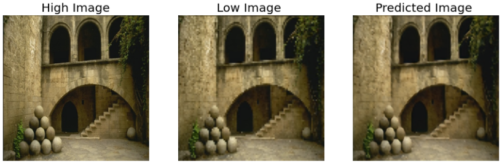

:notebook: Image Upscaling DCNN with Keras
=============

A very simple image upscaling deep convolutional neural network (DCNN) made using Keras. The network is trained on the [BSDS500](https://paperswithcode.com/dataset/bsds500) dataset.

 

    
      
    <a href="https://github.com/javierburgosv/dcnn-upscaler/blob/main/ImageUpscaler.ipynb">
        

            Preview Notebook
        

    </a>

 

:mag: About
----
This is a basic experiment to learn about image processing using Keras. The trained model is being deployed on this [repository](https://github.com/javierburgosv/picplus-image-upscaler) to showcase the results as part of a full stack data science demo project.

Feel free to fork this repo and experiment with the code.
